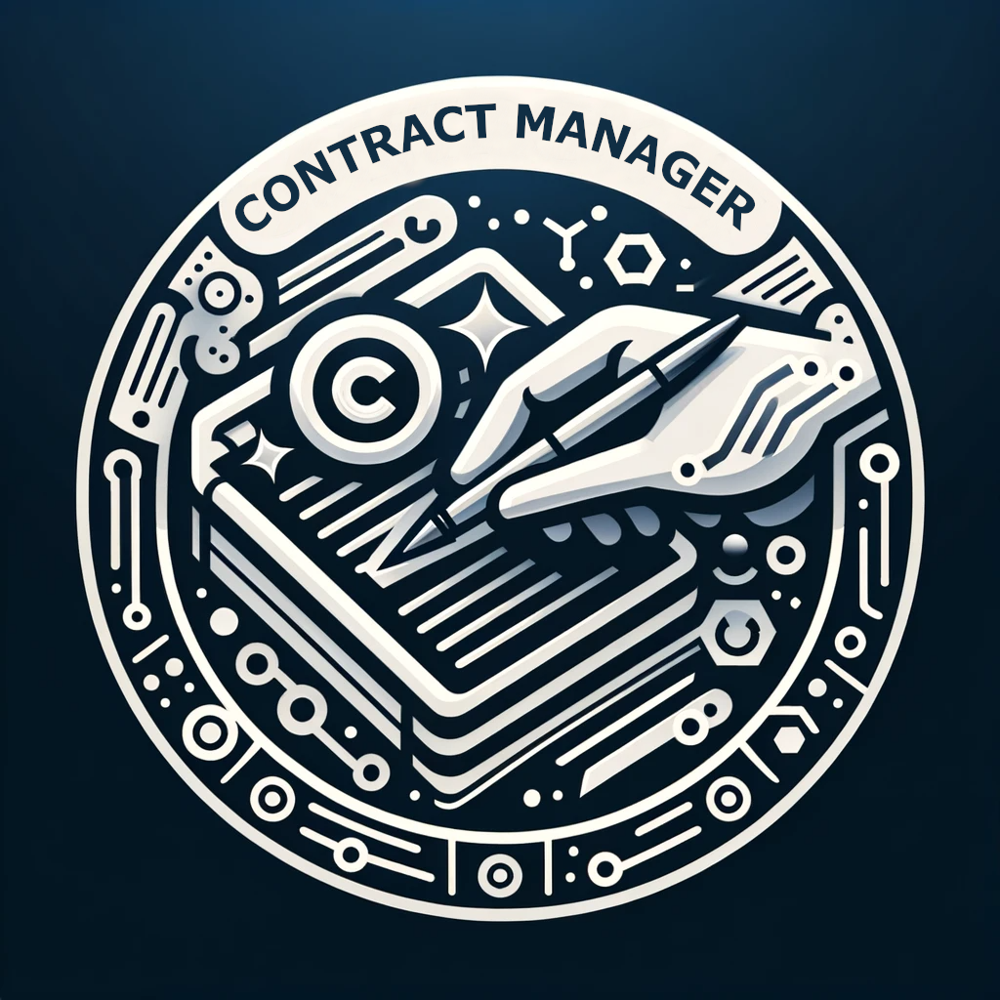

# Deel contract Manager v1.0.0

<div style="max-width: 600px; margin: 0 auto;">
 <p align="center"> 
 
</p>
</div>


# Project Description:

Welcome to Deel contract manager, this API is developed in Node.js and Express.js, is a robust solution for efficient contract management. It utilizes Sequelize over SQLite for optimized database operations, ensuring secure transactions and effective concurrency handling with asynchronous programming. It features RESTful APIs, secure authentication, and a scalable architecture that ensures high performance and data consistency in high-demand environments. This tool is ideal for settings that require precise and secure handling of transactions and contracts.


# Installation instructions:

## Check at the code documentation here to see the whole setup:

<p>
  <a href="https://docs.google.com/document/d/1P5Jr75Lh9GwUGBcNXzLMkd4PS7kgKRSO8R62q6oxZaE/edit?usp=sharing" target="_blank">
   Link to code documentation
  </a>
</p>

## Step 1:

## Install all packages through npm.
```sh
npm install
```

## Step 2:

## Seed the database 🌱🌱:

```sh
npm run seed
```

## Step 3:

## Run the desired service:

### To run development server🔓🛠:

```sh
npm run dev
```
### To run production ready code 👩‍🚀👩‍🚀👩‍🚀🚀:

```sh
npm run start
```

## To run test 📕📖🔍🔐:

```sh
npm run test
```

## To use it Docker🐳:

### To build the docker image:  

```sh
docker build --no-cache -t name-of-image .
```

### To build the container:
```sh
docker run  -p 8080 -d name-of-image
```
This will expose the port from our localserver